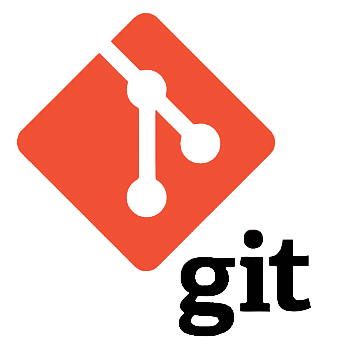

### Hi there 👋, I am [Bill](https://github.com/VC-D)! 😁
<!--
**VC-D/VC-D** is a ✨ _special_ ✨ repository because its `README.md` (this file) appears on your GitHub profile.
Here are some ideas to get you started:

- 🔭 I’m currently working on ...
- 🌱 I’m currently learning ...
- 👯 I’m looking to collaborate on ...
- 🤔 I’m looking for help with ...
- 💬 Ask me about ...
- 📫 How to reach me: ...
- 😄 Pronouns: ...
- ⚡ Fun fact: ...
- 🤔 I’m looking for help with Statistics
- 👯 I’m looking to collaborate on ...
-->

Hello, my name is Vasilis - Christos Dragkolas and I am

- 🔭 I’m currently 
- 💬 Brainstorm with me over tech, algorithms, career, and music 
- 📫 How to reach me: v.c.dragk@gmail.com
- 😄 Pronouns: Data Analyst/He
- ⚡ Fun fact: Checkout my LinkedIn profile: [Vasilis Dragkolas](https://www.linkedin.com/in/dragkolas)
- 📝 [Resume](CV_.pdf)

**Languages and Tools:** 

<code></code>
<code></code>
<code></code>
<code></code>
<code></code>
<code></code>
